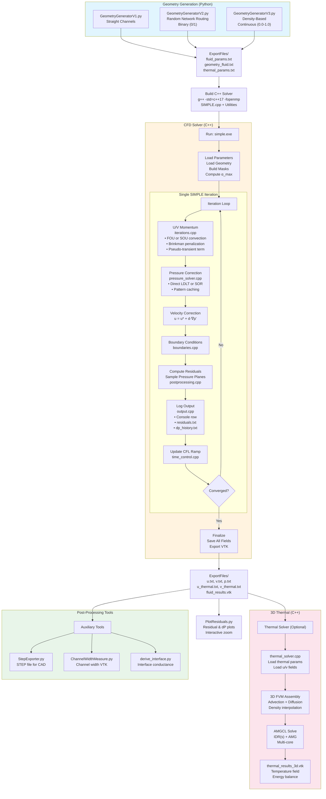

# SIMPLE CFD Solver (C++)

## Overview
Laminar, incompressible SIMPLE solver on a structured Cartesian grid (finite volume, steady-state with pseudo-transient relaxation). Geometry, fluid fields, and postprocessing are all contained in this repo; no external CFD suite needed.

## Components (key files)

### C++ Solver Core
| File | Description |
|------|-------------|
| `SIMPLE.h` | Central registry of all solver parameters, staggered grid fields, and function declarations |
| `SIMPLE.cpp` | Main driver: initialization, iteration loop, convergence checking, file I/O orchestration |

### C++ Utility Modules
| File | Description |
|------|-------------|
| `Utilities/iterations.cpp` | Single SIMPLE iteration: momentum solve, pressure correction, velocity correction |
| `Utilities/pressure_solver.cpp` | Pressure Poisson equation solver interface (calls CPU/GPU backends) |
| `Utilities/momentum_solver.cpp` | Momentum equation solver interface (Unified U/V templated solver) |
| `Utilities/convection.cpp` | Second-order upwind (SOU) deferred corrections for convection |
| `Utilities/boundaries.cpp` | Inlet/outlet/wall boundary conditions for velocity and pressure |
| `Utilities/masks.cpp` | Precomputed fluid/solid masks for staggered U/V/P grids |
| `Utilities/time_control.cpp` | Pseudo-CFL ramping and time-step statistics logging |
| `Utilities/output.cpp` | File I/O: residuals, pressure history, VTK export, thermal cropping |
| `Utilities/postprocessing.cpp` | Physical location-based pressure/velocity sampling |

### modular Solvers (`Utilities/solvers/`)
| Directory | Description |
|-----------|-------------|
| `linalg.h` | Common CSR structures and linear algebra primitives |
| `cpu/` | **CPU Solvers:** `jacobi_solver.cpp` (Mom), `pcg_solver.cpp` (Pres), `amgcl_cpu_solver.h` |
| `gpu/` | **GPU Solvers:** `pressure_solver.cu` (AMGCL-CUDA), `momentum_solver.cu` (Jacobi), `cuda_common.cuh` |

### Thermal Solver
| File | Description |
|------|-------------|
| `ThermalSolver/thermal_solver.cpp` | 3D conjugate heat transfer solver using AMGCL (AMG + IDR(s)) |

### Python Tools
| File | Description |
|------|-------------|
| `GeometryGeneratorV1.py` | Simple straight channel geometry generator |
| `GeometryGeneratorV2.py` | Random network routing with Manhattan/diagonal paths, split/merge logic |
| `GeometryGeneratorV3.py` | **Density-based** continuous geometry for topology optimization |
| `main.py` | Driver for thermal solver; handles parameter loading |
| `PlotResiduals.py` | Interactive plotting of residuals and pressure drops |
| `derive_interface.py` | Helper for interface conductance calculations |
| `StepExporter.py` | Export geometry to STEP format (using gmsh) |
| `ChannelWidthMeasure.py` | Compute local channel width field via medial axis |

## Build
Requires [Eigen](https://eigen.tuxfamily.org/) headers. **Eigen 3.4.0 is included in `Utilities/eigen-3.4.0/`** for portability.

**Windows (MinGW):**
```
g++ -std=c++17 -fopenmp SIMPLE.cpp Utilities\boundaries.cpp Utilities\iterations.cpp Utilities\output.cpp Utilities\postprocessing.cpp Utilities\pressure_solver.cpp Utilities\momentum_solver.cpp Utilities\convection.cpp Utilities\time_control.cpp Utilities\masks.cpp Utilities\solvers\cpu\pcg_solver.cpp Utilities\solvers\cpu\jacobi_solver.cpp -I. -I"Utilities\eigen-3.4.0" -O3 -o simple.exe
```

**Linux/macOS:**
```
g++ -std=c++17 -fopenmp SIMPLE.cpp Utilities/boundaries.cpp Utilities/iterations.cpp Utilities/output.cpp Utilities/postprocessing.cpp Utilities/pressure_solver.cpp Utilities/momentum_solver.cpp Utilities/convection.cpp Utilities/time_control.cpp Utilities/masks.cpp Utilities/solvers/cpu/pcg_solver.cpp Utilities/solvers/cpu/jacobi_solver.cpp -I. -I"Utilities/eigen-3.4.0" -O3 -o simple
```

## How to run
1) Generate geometry/params:
```
python GeometryGeneratorV3.py  # (or V1/V2 depending on needs)
```
This writes `ExportFiles/fluid_params.txt` and geometry matrices.

2) Build (see above) and run the solver (`simple.exe` or `./simple`).

3) Postprocess/plot residuals:
```
python PlotResiduals.py
```
Results (fields, histories, VTK) land in `ExportFiles/`.

## Workflow (quick start)
- Generate geometry: `python GeometryGeneratorV3.py`
- Build: g++ command above (uses local Eigen from `Utilities/eigen-3.4.0/`)
- Run: `./simple.exe` (or `./simple` on *nix)
- Plot: `python PlotResiduals.py`
- Thermal: `cd ThermalSolver && ./thermal_solver.exe ../ExportFiles`
- Inspect outputs in `ExportFiles/` (VTK + text + PNGs)

## Tuning knobs (SIMPLE.h)
- Pressure solver: `pressureSolverType` (0=SOR, 1=Parallel CG, 2=AMGCL, 3=LDLT, 4=AMGCL-CUDA).
- Momentum solver: `momentumSolverType` (0=Explicit, 1=Implicit Jacobi/SOR).
- Relaxation: `uvAlpha`, `pAlpha`; SOR params: `maxPressureIter`, `sorOmega` (auto if 0), `pTol`.
- Pseudo time/CFL ramp: `enablePseudoTimeStepping`, `enableCflRamp`, `pseudoCFLInitial/Max`, `cflRamp*`, `useLocalPseudoTime`.
- Convection scheme: `convectionScheme = 0/1` (FOU/SOU).
- Iteration limits/convergence: `maxIterations`, `epsilon`, pressure-drop convergence options.
- Inlet ramp: `enableInletRamp`, `rampSteps`.
- Optional 2.5D model (two-layer microchannel): set `enableTwoPointFiveD = true`. This activates the **2.5D Pressure Drop Model**, which applies user-configurable convection scaling (`twoPointFiveDConvectionFactor`, default 1.0) and the $-(12\mu/H_t^2)$ linear sink term to account for out-of-plane drag. `Ht_channel` is read automatically from `ExportFiles/fluid_params.txt`.

## Density-Based Topology Optimization (MMA-ready)
Based on: *"Topology optimization of microchannel heat sinks using a two-layer model"* (Haertel et al., 2018)

### Overview
Instead of binary solid/fluid (0/1), the solver supports a **continuous density field** (gamma):
- `gamma = 1.0` → pure fluid
- `gamma = 0.0` → pure solid  
- `0 < gamma < 1` → transition/buffer zone

This enables gradient-based topology optimization (MMA) and prevents numerical issues with abrupt material property changes.

### Brinkman Penalization
Flow through "solid" regions is penalized via Brinkman friction:
```
F(gamma) = -alpha_max * u * I_alpha(gamma)
I_alpha(gamma) = (1 - gamma) / (1 + b_alpha * gamma)
```
- `alpha_max = mu / K_min` — maximum inverse permeability (material-based)
- `b_alpha` — convexity parameter (controls interpolation sharpness)
- `K_min` — solid-side permeability (lower = more solid-like)

### Parameters (SIMPLE.h)
- `brinkmanKMin = 1e-14` — solid-side permeability [m²] for Brinkman penalization

### Geometry Files
- **GeometryGeneratorV1**: Simple straight parallel channels
- **GeometryGeneratorV2**: Random network routing with split/merge (binary output)
- **GeometryGeneratorV3**: Density-based with buffer zones (continuous 0.0-1.0)

Output files:
- `geometry_fluid.txt` — geometry for CFD solver (binary or continuous)
- `geometry_thermal.txt` — geometry for thermal solver (binary or continuous)

**File convention**: `0 = fluid`, `1 = solid`, intermediate values = buffer/transition zones

## Inputs & knobs
- Main parameters live in `SIMPLE.h` (relaxation, CFL ramp, max iterations, convergence eps, ramp steps, etc.).
- Geometry and mesh come from `GeometryGeneratorV*.py` (refinement, channel layout, buffers).
- `GeometryGenerator*.py` also exports `Ht_channel` (out-of-plane height) for the optional 2.5D physics; no manual C++ edit is needed.
- Pressure solver: toggle direct vs iterative in `SIMPLE.h` (`pressureSolverType`).

## Outputs
- `ExportFiles/residuals.txt`, `pressure_drop_history.txt` (plus PNGs).
- Field dumps: `u*.txt`, `v*.txt`, `p*.txt`, VTK files for visualization.
- Final console summary of residuals and pressure drops (core and full domain).

## Thermal Solver (C++)
The thermal post-processor (`ThermalSolver/thermal_solver.cpp`) performs 3D conjugate heat transfer:
- **3D Structured Grid**: Non-uniform z-spacing (solid base + fluid/fin region)
- **Density-Based**: Supports continuous gamma field with interpolated thermal conductivity
- **Fast Solver**: AMGCL library with IDR(s) Krylov method and AMG preconditioning
- **Output**: Unstructured VTK with temperature, velocity, region fields

## Notes
- Steady laminar only; pseudo-transient stepping is for convergence aid, not real-time accuracy.
- All fluid properties are set in `SIMPLE.h` (density/viscosity hardcoded).
- Direct pressure solve uses Eigen SimplicialLDLT; symbolic pattern is reused across iterations for speed. SOR fallback remains available.

## Flowchart (pipeline)

